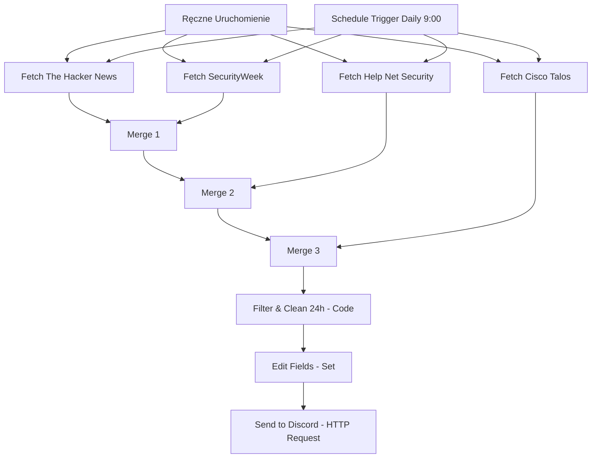

# 🚨 Breach & Infection Notifier (n8n Workflow)

Automatyczny system agregacji i monitorowania informacji o cyberatakach, wyciekach danych (data breaches), ransomware oraz infekcjach złośliwym oprogramowaniem z ostatnich **24 godzin** z renomowanych angielskojęzycznych źródeł, z bezpośrednimi powiadomieniami na kanał Discord (w formie estetycznych kart Rich Embed).

Ten workflow łączy dane z czterech niezależnych feedów RSS, filtruje je, pozostawiając wyłącznie wpisy opublikowane w ciągu ostatnich 24 godzin od uruchomienia, deduplikuje powtarzające się wpisy, oczyszcza treść z kodu HTML/encji oraz ogranicza liczbę wysyłanych wiadomości do maksymalnie 15 najnowszych (zabezpieczenie przed floodowaniem) i wysyła je na Discorda.

## 📋 Spis Treści
1. [Struktura i Schemat Działania](#-struktura-i-schemat-działania)
2. [Źródła Danych (Feedy RSS)](#-źródła-danych-feedy-rss)
3. [Elementy Przepływu (Nodes)](#-elementy-przepływu-nodes)
4. [Instrukcja Instalacji i Konfiguracji](#-instrukcja-instalacji-i-konfiguracji)
5. [Jak Działa Filtrowanie, Deduplikacja i Formatowanie (JavaScript)](#-jak-działa-filtrowanie-deduplikacja-i-formatowanie-javascript)
6. [Struktura Powiadomienia Discord](#-struktura-powiadomienia-discord)

---

## 🗺️ Struktura i Schemat Działania

Przepływ działa w pełni automatycznie. Pobiera dane równolegle z czterech stabilnych kanałów RSS, łączy je za pomocą kaskadowych węzłów `Merge`, a następnie w węźle `Code` filtruje według czasu publikacji, usuwa duplikaty i oczyszcza treść artykułów. Ustandaryzowany zestaw danych trafia do końcowego węzła HTTP Request, który wysyła osobny webhook dla każdego incydentu na Discorda.



---

## 📡 Źródła Danych (Feedy RSS)

System pobiera informacje wyłącznie z wiarygodnych, zagranicznych (angielskojęzycznych) portali i platform specjalizujących się w tematyce cyberbezpieczeństwa, które nie blokują standardowych parserów RSS (kod stanu 200):

1. **The Hacker News** (`https://feeds.feedburner.com/TheHackersNews`) – Wiodące, globalne źródło wiadomości o atakach hakerskich, wyciekach danych, lukach zero-day oraz operacjach grup APT.
2. **SecurityWeek** (`https://www.securityweek.com/feed/`) – Renomowany portal dostarczający najnowsze informacje o incydentach naruszenia bezpieczeństwa danych, ransomware, kampaniach malware i bezpieczeństwie korporacyjnym.
3. **Help Net Security** (`https://www.helpnetsecurity.com/feed/`) – Niezależna witryna informacyjna skupiona wokół cyberzagrożeń, wycieków baz danych oraz technicznych aspektów łagodzenia skutków ataków.
4. **Cisco Talos Blog** (`https://blog.talosintelligence.com/feed/`) – Oficjalny blog jednej z największych komercyjnych grup zajmujących się wykrywaniem i analizą zagrożeń (threat intelligence) na świecie. Zawiera dogłębne analizy kampanii złośliwego oprogramowania oraz aktywności grup cyberprzestępczych.

---

## ⚙️ Elementy Przepływu (Nodes)

* **Triggery (Wyzwalacze)**:
  * `When clicking 'Test workflow'` – Ręczne uruchomienie całego przepływu w celu weryfikacji działania lub testów.
  * `Schedule Trigger` – Uruchamia przepływ automatycznie codziennie o godzinie **09:00**.
* **Węzły Pobierania RSS (`rssFeedRead`)**:
  * Cztery równoległe instancje pobierające wpisy RSS z podanych adresów URL i parsujące je bezpośrednio w n8n na obiekty JSON.
  * Wszystkie węzły posiadają włączoną opcję **Continue On Fail** (w razie niedostępności lub błędu jednego z portali, workflow nie przerywa działania i przetwarza pozostałe źródła).
* **Węzły Scalania (`merge`)**:
  * Trzy połączone kaskadowo węzły typu *Merge* w trybie *Append* łączące poszczególne listy artykułów w jedną płaską listę danych wejściowych.
* **Filter & Clean (24h) (`code`)**:
  * Węzeł wykonujący zoptymalizowany kod JavaScript. Odpowiada za:
    * Odrzucenie artykułów starszych niż 24 godziny.
    * Eliminację duplikatów (np. jeśli ten sam incydent został opisany na kilku portalach pod tym samym linkiem).
    * Oczyszczenie tekstu z tagów HTML (często obecnych w opisach RSS), spacji niełamliwych `&nbsp;` oraz dekodowanie encji HTML.
    * Skrócenie opisu do max 500 znaków (z czytelnym wielokropkiem `...` na końcu) w celu zachowania przejrzystości na telefonach i Discordzie.
    * Przypisanie przejrzystej nazwy źródła na podstawie domeny w linku.
    * Ograniczenie wyniku do 15 najświeższych wpisów (zabezpieczenie przed floodem).
* **Edit Fields (`set`)**:
  * Mapuje i standaryzuje pola wyjściowe: `title`, `content`, `link`, `pubDate`, `source`.
* **Send to Discord (`httpRequest`)**:
  * Węzeł wykonujący zapytanie HTTP POST do Discord Webhook. Wysyła powiadomienie jako embed. Wykonuje się automatycznie w pętli dla każdego elementu przekazanego z poprzedniego węzła.

---

## 🚀 Instrukcja Instalacji i Konfiguracji

### 1. Import Workflow do n8n
1. Pobierz lub skopiuj zawartość pliku [`Breach_and_Infection_Notifier.json`](./Breach_and_Infection_Notifier.json).
2. W panelu zarządzania n8n stwórz nowy workflow.
3. Kliknij ikonę trzech kropek w prawym górnym rogu ekranu i wybierz **Import from JSON** (lub po prostu kliknij na pustym polu roboczym i wklej zawartość za pomocą skrótu klawiszowego `Ctrl+V`).

### 2. Utworzenie Webhooka na Discordzie
1. Otwórz aplikację Discord i przejdź do ustawień kanału tekstowego, na którym chcesz otrzymywać powiadomienia.
2. Wejdź w zakładkę **Integracje** (Integrations) -> **Webhooki** (Webhooks).
3. Kliknij **Stwórz Webhook** (Create Webhook), nadaj mu dowolną nazwę (np. "Cyber Threat Bot") i skopiuj jego URL.

### 3. Konfiguracja w n8n
1. W zaimportowanym workflow kliknij dwukrotnie na ostatni węzeł o nazwie **Send to Discord**.
2. W polu **URL** wklej skopiowany wcześniej adres webhooka Discorda (zamiast domyślnego `https://discord.com/api/webhooks/TUTAJ_WPISZ_TWÓJ_WEBHOOK_URL`).
3. Zapisz zmiany w workflow (`Ctrl+S`) i aktywuj go za pomocą przełącznika **Active** w prawym górnym rogu.

---

## 🧠 Jak Działa Filtrowanie, Deduplikacja i Formatowanie (JavaScript)

Poniższy kod JavaScript uruchamiany jest w węźle **Filter & Clean (24h)**:

```javascript
const items = $input.all();
const now = new Date();
const twentyFourHoursAgo = now.getTime() - 24 * 60 * 60 * 1000;

const seenLinks = new Set();
const filteredItems = [];

for (const item of items) {
  const json = item.json;
  
  const title = json.title || '';
  const content = json.contentSnippet || json.content || json.description || json.summary || '';
  const link = json.link || '';
  const pubDateStr = json.pubDate || json.isoDate || json.date || '';
  
  if (!title || !link) continue;
  
  const pubDate = new Date(pubDateStr);
  const pubTime = pubDate.getTime();
  
  // Filtrowanie do 24h
  const isLast24h = !isNaN(pubTime) && pubTime >= twentyFourHoursAgo;
  if (!isLast24h) continue;
  
  // Deduplikacja po URL
  const cleanLink = link.trim().toLowerCase();
  if (seenLinks.has(cleanLink)) continue;
  seenLinks.add(cleanLink);
  
  // Identyfikacja źródła
  let source = 'Security News';
  if (link.includes('thehackernews.com') || link.includes('feedburner')) {
    source = 'The Hacker News';
  } else if (link.includes('securityweek.com')) {
    source = 'SecurityWeek';
  } else if (link.includes('helpnetsecurity.com')) {
    source = 'Help Net Security';
  } else if (link.includes('talosintelligence.com') || link.includes('cisco')) {
    source = 'Cisco Talos';
  }
  
  // Oczyszczanie z tagów HTML, encji i skracanie do 500 znaków
  const cleanContent = content
    .replace(/<[^>]*>/g, '')
    .replace(/&nbsp;/g, ' ')
    .replace(/&amp;/g, '&')
    .replace(/&lt;/g, '<')
    .replace(/&gt;/g, '>')
    .replace(/&quot;/g, '"')
    .replace(/\s+/g, ' ')
    .trim()
    .substring(0, 500);
  
  filteredItems.push({
    json: {
      title: title.trim().replace(/&amp;/g, '&').replace(/&lt;/g, '<').replace(/&gt;/g, '>').replace(/&quot;/g, '"'),
      content: cleanContent + (content.length > 500 ? '...' : ''),
      link: link.trim(),
      pubDate: pubDateStr,
      pubTime: pubTime,
      source: source
    }
  });
}

// Sortowanie chronologiczne od najnowszych
filteredItems.sort((a, b) => b.json.pubTime - a.json.pubTime);

// Zabezpieczenie przed floodem (max 15 najnowszych)
return filteredItems.slice(0, 15);
```

---

## 📊 Powiadomienie Discord

Wiadomości wysyłane są w postaci bogatego formatowania (Rich Embed) o czerwonym kolorze bocznym. Każdy artykuł posiada:
*   **Tytuł (z ikoną 🚨)**: Działający jako bezpośredni, klikalny hiperlink do pełnego artykułu.
*   **Opis**: Skrócona do 500 znaków, czytelna treść bez tagów HTML.
*   **Stopka (Footer)**: Informacja o zidentyfikowanym źródle wiadomości (np. *Source: The Hacker News*) oraz oryginalna data publikacji artykułu.

Przykładowy payload wysyłany do Discord API:
```json
{
  "embeds": [
    {
      "title": "🚨 Ransomware attack hits major infrastructure operator",
      "description": "A new malware campaign is active targeting systems worldwide using advanced evasion techniques. Security experts recommend immediate patching...",
      "url": "https://feeds.feedburner.com/TheHackersNews",
      "color": 15158332,
      "footer": {
        "text": "Source: The Hacker News | Wed, 03 Jun 2026 14:15:22 GMT"
      }
    }
  ]
}
```
