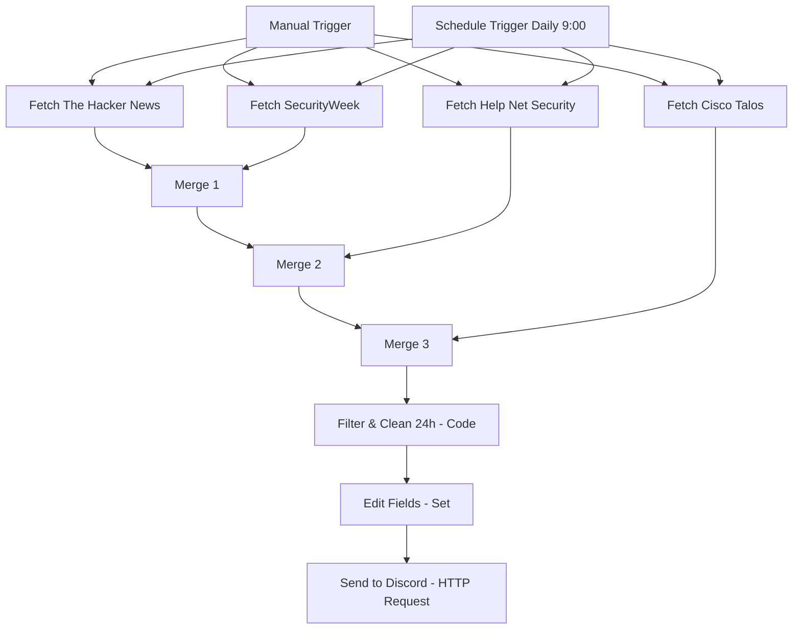

# 🚨 Breach & Infection Notifier (n8n Workflow)

An automated system for aggregating and monitoring information about cyberattacks, data breaches, ransomware, and malware infections from the last **24 hours** from reputable English-language sources, with direct notifications to a Discord channel (in the form of aesthetic Rich Embed cards).

This workflow combines data from four independent RSS feeds, filters them to keep only entries published within the last 24 hours of execution, deduplicates repeating entries, cleans the content of HTML tags/entities, limits the number of sent messages to a maximum of 15 newest entries (flood protection), and sends them to Discord.

## 📋 Table of Contents
1. [Structure and Workflow Schema](#-structure-and-workflow-schema)
2. [Data Sources (RSS Feeds)](#-data-sources-rss-feeds)
3. [Workflow Nodes](#-workflow-nodes)
4. [Installation and Configuration Guide](#-installation-and-configuration-guide)
5. [How Filtering, Deduplication, and Formatting Works (JavaScript)](#-how-filtering-deduplication-and-formatting-works-javascript)
6. [Discord Notification Structure](#-discord-notification-structure)

---

## 🗺️ Structure and Workflow Schema

The workflow runs fully automatically. It fetches data in parallel from four stable RSS channels, merges them using cascading Merge nodes, and then in a Code node filters them by publication time, removes duplicates, and cleans the article content. The standardized dataset is sent to the final HTTP Request node, which sends a separate webhook for each incident to Discord.



---

## 📡 Data Sources (RSS Feeds)

The system retrieves information exclusively from reliable, English-language portals and platforms specializing in cybersecurity that do not block standard RSS parsers (status code 200):

1. **The Hacker News** (`https://feeds.feedburner.com/TheHackersNews`) – A leading global source of news on hacking attacks, data breaches, zero-day vulnerabilities, and APT group operations.
2. **SecurityWeek** (`https://www.securityweek.com/feed/`) – A renowned portal delivering the latest information on data breach incidents, ransomware, malware campaigns, and corporate security.
3. **Help Net Security** (`https://www.helpnetsecurity.com/feed/`) – An independent news site focused on cyber threats, database breaches, and technical aspects of attack mitigation.
4. **Cisco Talos Blog** (`https://blog.talosintelligence.com/feed/`) – The official blog of one of the largest commercial threat intelligence groups in the world. It contains in-depth analyses of malware campaigns and cybercriminal group activities.

---

## ⚙️ Workflow Nodes

* **Triggers**:
  * `When clicking 'Test workflow'` – Manual execution of the entire workflow for verification or testing.
  * `Schedule Trigger` – Runs the workflow automatically every day at **09:00**.
* **RSS Fetching Nodes (`rssFeedRead`)**:
  * Four parallel instances fetching RSS entries from the specified URLs and parsing them directly into JSON objects within n8n.
  * All nodes have the **Continue On Fail** option enabled (in case one of the portals is unavailable or encounters an error, the workflow continues running and processes the remaining sources).
* **Merge Nodes (`merge`)**:
  * Three cascading Merge nodes in Append mode combining individual article lists into a single flat list of input data.
* **Filter & Clean (24h) (`code`)**:
  * A node executing optimized JavaScript code. It is responsible for:
    * Rejecting articles older than 24 hours.
    * Eliminating duplicates (e.g., if the same incident was described on multiple portals with the same link).
    * Cleaning the text of HTML tags (often present in RSS descriptions), non-breaking spaces `&nbsp;`, and decoding HTML entities.
    * Shortening the description to a maximum of 500 characters (with a clean ellipsis `...` at the end) to maintain clarity on mobile devices and Discord.
    * Assigning a clear source name based on the domain in the link.
    * Limiting the result to the 15 freshest entries (flood protection).
* **Edit Fields (`set`)**:
  * Maps and standardizes output fields: `title`, `content`, `link`, `pubDate`, `source`.
* **Send to Discord (`httpRequest`)**:
  * A node performing an HTTP POST request to a Discord Webhook. Sends notifications as embeds. Executes automatically in a loop for each item passed from the previous node.

---

## 🚀 Installation and Configuration Guide

### 1. Import Workflow to n8n
1. Download or copy the contents of the [Breach_and_Infection_Notifier.json](./Breach_and_Infection_Notifier.json) file.
2. Create a new workflow in the n8n management panel.
3. Click the three dots icon in the top right corner of the screen and select **Import from JSON** (or simply click on the empty canvas and paste the contents using the `Ctrl+V` shortcut).

### 2. Create a Webhook on Discord
1. Open Discord and go to the settings of the text channel where you want to receive notifications.
2. Go to the **Integrations** tab -> **Webhooks**.
3. Click **Create Webhook**, give it a name (e.g., "Cyber Threat Bot"), and copy its URL.

### 3. Configure in n8n
1. In the imported workflow, double-click the last node named **Send to Discord**.
2. In the **URL** field, paste the copied Discord webhook URL (instead of the placeholder `https://discord.com/api/webhooks/YOUR_WEBHOOK_URL_HERE`).
3. Save changes to the workflow (`Ctrl+S`) and activate it using the **Active** toggle in the top right corner.

---

## 🧠 How Filtering, Deduplication, and Formatting Works (JavaScript)

The following JavaScript code runs in the **Filter & Clean (24h)** node:

```javascript
const items = $input.all();
const now = new Date();
const twentyFourHoursAgo = now.getTime() - 24 * 60 * 60 * 1000;

const seenLinks = new Set();
const filteredItems = [];

for (const item of items) {
  const json = item.json;
  
  const title = json.title || '';
  const content = json.contentSnippet || json.content || json.description || json.summary || '';
  const link = json.link || '';
  const pubDateStr = json.pubDate || json.isoDate || json.date || '';
  
  if (!title || !link) continue;
  
  const pubDate = new Date(pubDateStr);
  const pubTime = pubDate.getTime();
  
  // Filter to last 24h
  const isLast24h = !isNaN(pubTime) && pubTime >= twentyFourHoursAgo;
  if (!isLast24h) continue;
  
  // Deduplicate by link
  const cleanLink = link.trim().toLowerCase();
  if (seenLinks.has(cleanLink)) continue;
  seenLinks.add(cleanLink);
  
  // Identify the source
  let source = 'Security News';
  if (link.includes('thehackernews.com') || link.includes('feedburner')) {
    source = 'The Hacker News';
  } else if (link.includes('securityweek.com')) {
    source = 'SecurityWeek';
  } else if (link.includes('helpnetsecurity.com')) {
    source = 'Help Net Security';
  } else if (link.includes('talosintelligence.com') || link.includes('cisco')) {
    source = 'Cisco Talos';
  }
  
  // Clean HTML tags and limit length
  const cleanContent = content
    .replace(/<[^>]*>/g, '')
    .replace(/&nbsp;/g, ' ')
    .replace(/&amp;/g, '&')
    .replace(/&lt;/g, '<')
    .replace(/&gt;/g, '>')
    .replace(/&quot;/g, '"')
    .replace(/\s+/g, ' ')
    .trim()
    .substring(0, 500);
  
  filteredItems.push({
    json: {
      title: title.trim().replace(/&amp;/g, '&').replace(/&lt;/g, '<').replace(/&gt;/g, '>').replace(/&quot;/g, '"'),
      content: cleanContent + (content.length > 500 ? '...' : ''),
      link: link.trim(),
      pubDate: pubDateStr,
      pubTime: pubTime,
      source: source
    }
  });
}

// Sort by date, newest first
filteredItems.sort((a, b) => b.json.pubTime - a.json.pubTime);

// Limit to top 15 newest entries to prevent flooding
return filteredItems.slice(0, 15);
```

---

## 📊 Discord Notification Structure

Messages are sent as rich embeds with a red side border. Each article features:
*   **Title (with a 🚨 icon)**: Acts as a direct, clickable hyperlink to the full article.
*   **Description**: Shortened to 500 characters, clean readable text without HTML tags.
*   **Footer**: Information about the identified news source (e.g., *Source: The Hacker News*) and the article's original publication date.

Example payload sent to the Discord API:
```json
{
  "embeds": [
    {
      "title": "🚨 Ransomware attack hits major infrastructure operator",
      "description": "A new malware campaign is active targeting systems worldwide using advanced evasion techniques. Security experts recommend immediate patching...",
      "url": "https://feeds.feedburner.com/TheHackersNews",
      "color": 15158332,
      "footer": {
        "text": "Source: The Hacker News | Wed, 03 Jun 2026 14:15:22 GMT"
      }
    }
  ]
}
```
